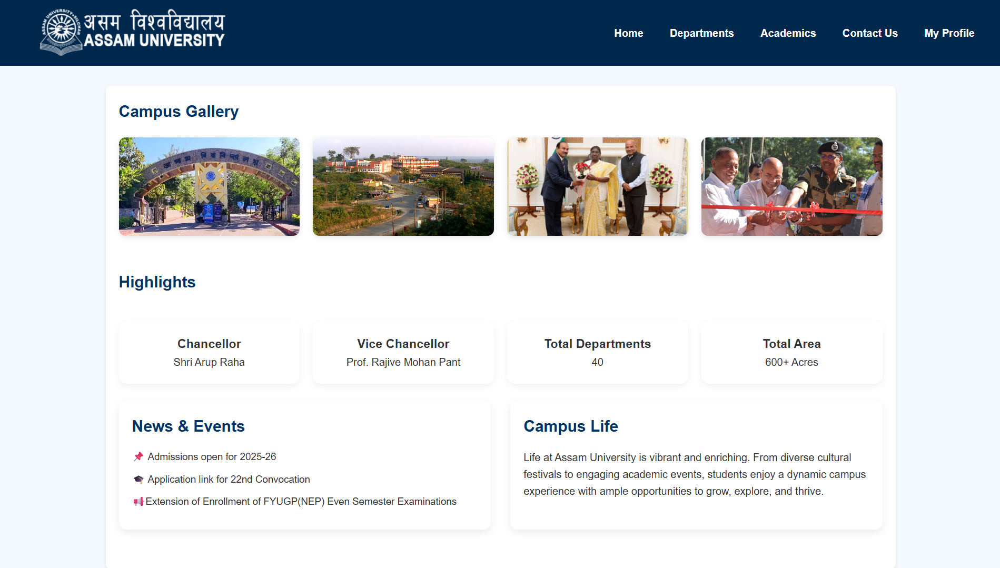
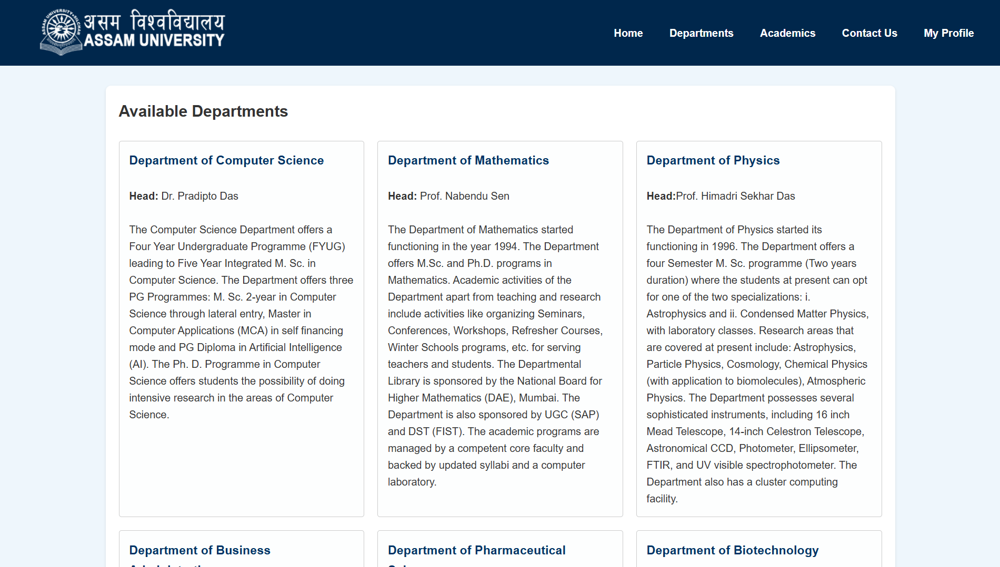
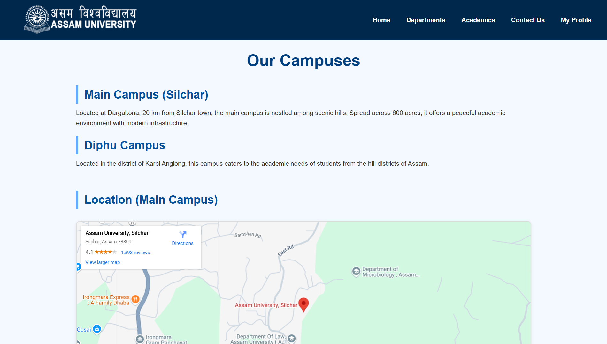
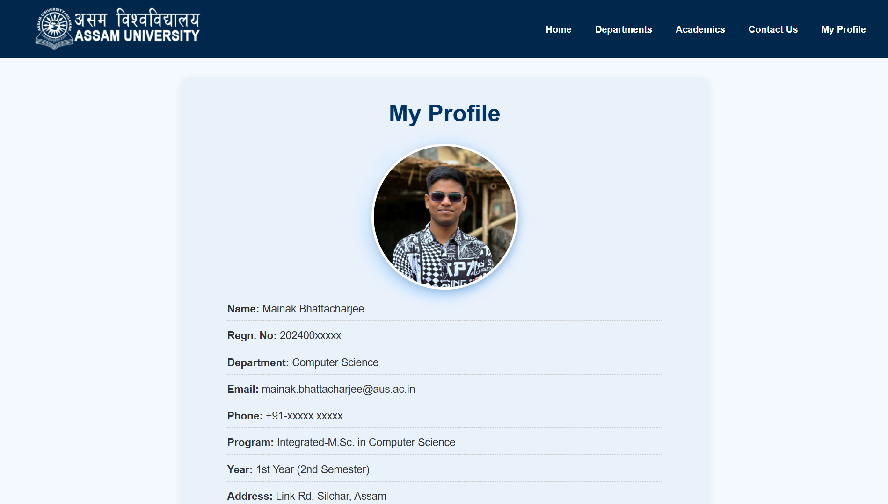

# 🎓 University Website – Front-End Project

This is a **multi-page static university website** built using **HTML**, **CSS**, and **JavaScript** 💡  
It simulates the layout and design of a real-world educational institution's website, and was developed as part of my university assignment.

---

## ✨ Key Features

- 🏠 **Multi-page layout** with consistent navigation
- 📱 **Responsive design** for various screen sizes
- 📰 **News & Events** section for updates
- 🏛️ **About the University** – history & mission
- 🏢 **Departments** – organized academic divisions
- 📚 **Academics Page** – list of programs & courses
- 🖼️ **Photo Gallery** – showcasing campus life
- 🧑‍💼 **Leadership & Stats** – Chancellor, V.C., etc.
- 📞 **Contact Page** – with working form interactions (JS)
- 🙋‍♂️ **My Profile Page** – personalized user info

---

## 🧰 Tech Stack

- **HTML5** – Structure & layout  
- **CSS3** – Styling & responsiveness  
- **JavaScript** – Basic interactivity

> 🛠️ JavaScript was added recently to improve user experience and bring light functionality into the site!

---

## 🎯 Project Objective

> The goal of this project was to simulate a real-world university website and strengthen front-end development skills.

### 📌 Key learning outcomes:

- Design and build a **multi-page site** from scratch
- Apply **semantic HTML** and structured CSS
- Add **dynamic behavior** with JavaScript
- Practice responsive layout planning
- Improve real-world UI/UX understanding

---

## 🚀 Live Demo

🔗 Hosted on **GitHub Pages**  👉 [Visit the Website](https://mainak-bhattacharjee.github.io/University-Website/)

---

## 🖼️ Screenshots

### 🏠 Home Page  

### 🏢 Departments Page  

### 📚 Academics Page  

### 📞 Contact Page  

### 👤 My Profile Page  

---

## 📈 Future Improvements

- Add more **JavaScript features** (gallery, toggles, etc.)
- Improve **form validation** and error handling
- Implement **smooth scrolling** and scroll-triggered animations
- Add **backend** (Node.js or Formspree) for contact form
- Make the site fully **accessible & keyboard-friendly**

---

## 📚 License

This project is part of a college assignment and is open-source for educational use.  
Licensed under the [MIT License](LICENSE).

---

## 👨‍🎓 Author

**Mainak Bhattacharjee**  
🎓 Student, Department of Computer Science  
📍 Assam University  
💼 Passionate about Web Development, AI & Tech  
🔗 [GitHub Profile](https://github.com/mainak-bhattacharjee)

---

> ⭐ Feel free to fork, star, and explore the code!
