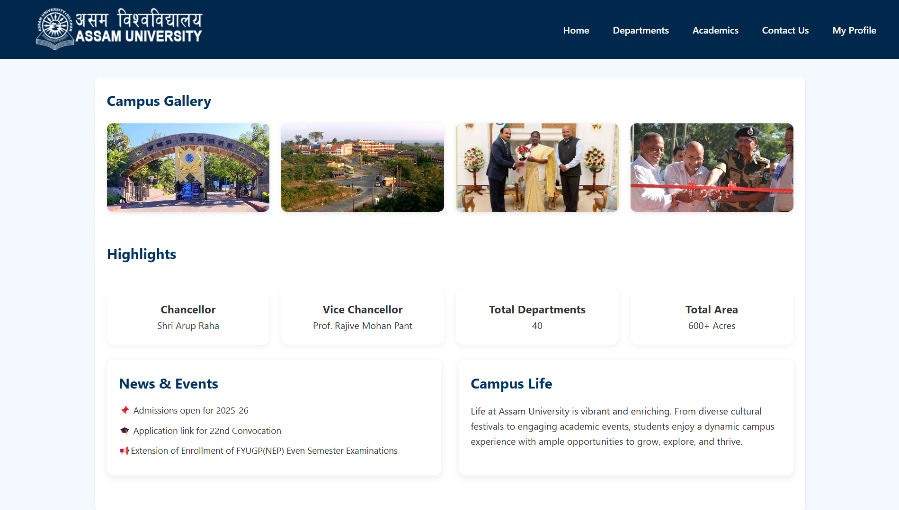
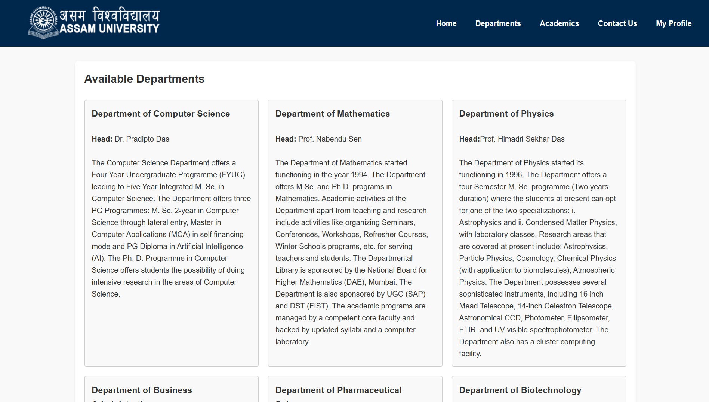
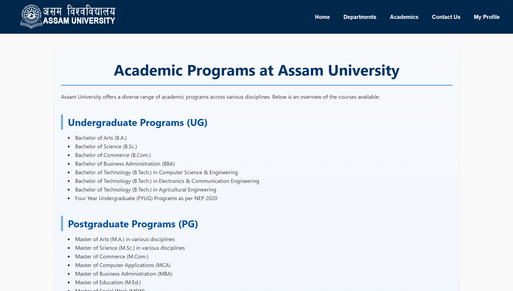
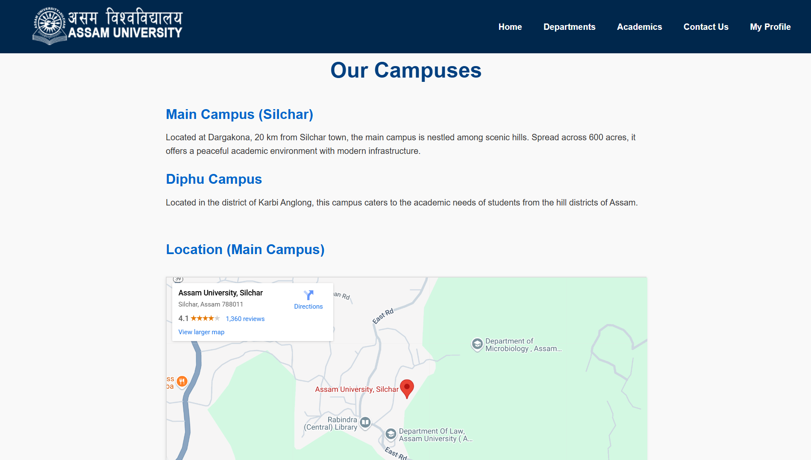
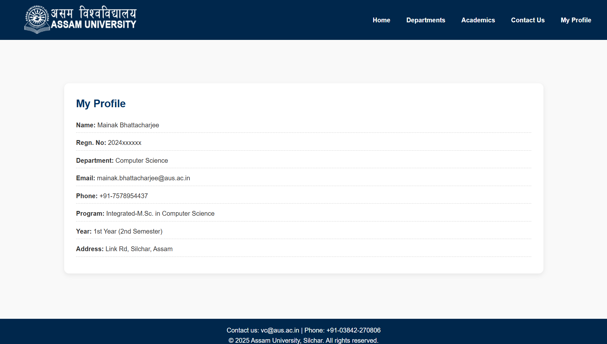

# University Website (Front-End)

This is a front-end project for a university website built using **HTML** and **CSS**. The website includes multiple pages and sections such as **News & Events**, **About the University**, **Photo Gallery**, and **Leadership & Stats** (showing details about the chancellor, vice chancellor, total departments, and total area).

## Features

- 📰 **News & Events**
- 🏫 **About the University**
- 📚 **Academics**
- 🏢 **Departments**
- 🖼️ **Photo Gallery**
- 📞 **Contact**
- 🙋‍♂️ **My Profile**

Each page is styled consistently with a clean UI and basic navigation to simulate a full website experience. Perfect for showcasing front-end development skills!

## Technologies Used

- **HTML** - For structuring the content.
- **CSS** - For styling and creating the layout.

## How to View

1. Clone the repository:  

2. Navigate to the project folder:

3. Open the `index.html` file in any web browser to see the website in action.

## Demo

You can view the live demo of the website here:  
[https://mainak-bhattacharjee.github.io/University-Website/](https://mainak-bhattacharjee.github.io/University-Website/))

## Screenshots

### 🏠 Home Page

### 🏛️ Department Page

### 📢 Academics Page

### 📍 Contact Page

### 👨‍🏫 Profile Page

## Future Improvements

- Add interactive elements using **JavaScript**.
- Include animations or transitions to enhance the user experience.
- Implement dynamic content management through back-end integration (if applicable).
- Improve accessibility features to make the site more inclusive.
- Ensures the site adapts to different devices (desktop, tablet, mobile).

## License

This project is open-source and available under the [MIT License](LICENSE).
